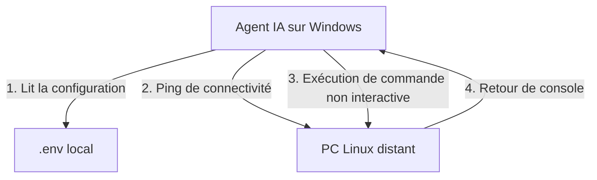

# ai-ssh-control — Pilotage SSH pour agents IA (Claude Code, Codex, Cursor...)

Protocole léger et sécurisé permettant à un agent IA (tel que Claude Code, Codex, Cursor ou Copilot) s'exécutant sur un système Windows de piloter directement un PC ou serveur Linux via SSH. Ce protocole évite le copier-coller manuel des commandes en automatisant l'interaction à travers PowerShell ou Bash.

## Principe

L'agent IA s'exécute localement sur Windows. Grâce aux instructions fournies dans sa configuration (`.claude/CLAUDE.md` pour Claude Code, ou `AGENTS.md` pour d'autres agents), il récupère les identifiants de connexion SSH stockés de manière sécurisée dans un fichier `.env` non versionné, puis exécute automatiquement les commandes requises sur la machine Linux distante.

## Architecture du protocole



Le protocole garantit un fonctionnement fluide et sans état :
1. **Zéro secret partagé sur Git** : Toutes les informations de connexion (IP, clé privée, utilisateur) restent locales dans un fichier `.env` exclus du versionnement.
2. **Robustesse** : L'agent effectue un ping avant chaque commande pour s'assurer que le lien réseau est actif.
3. **Sécurité et non-interactivité** : L'agent utilise des commandes non-interactives et exploite des clés privées limitées pour éviter tout blocage.

## Contenu du dépôt

- [CONTROLE_SSH_AI.md](CONTROLE_SSH_AI.md) — Documentation complète : prérequis, instructions à donner à l'agent, commandes de référence, limites et dépannage.
- [CLAUDE.md](CLAUDE.md) — Fichier d'instructions spécifiques pour Claude Code (à copier dans `.claude/CLAUDE.md`).
- [AGENTS.md](AGENTS.md) — Fichier d'instructions génériques pour les agents IA tiers (Codex, Cursor, etc.).
- [init_connexion.md](init_connexion.md) — Procédure interactive guidée pour tester et initialiser la connexion SSH.

## Prérequis

- PC Windows équipé d'un agent IA capable d'exécuter des commandes système (PowerShell ou Bash).
- Machine ou PC Linux cible avec service SSH actif et clé SSH autorisée.
- Les deux machines sur le même réseau local (LAN, VPN, ou partage de connexion Windows).

## Initialisation rapide avec l'agent IA

Plutôt que de configurer manuellement, donnez simplement ce prompt à votre agent (Claude Code ou autre) :

```text
Lis le fichier init_connexion.md et suis la procédure pour initialiser la connexion SSH.
```

L'agent vous guidera étape par étape, testera la connectivité et configurera automatiquement le fichier `.env` local.

---

## Démarrage rapide (manuel)

1. Générer une clé SSH sur Windows :
```powershell
ssh-keygen -t ed25519 -f C:\Users\<user>\.ssh\ma_cle_ed25519
```

2. Copier la clé publique sur la machine Linux :
```powershell
type C:\Users\<user>\.ssh\ma_cle_ed25519.pub | ssh <user>@<IP_LINUX> "cat >> ~/.ssh/authorized_keys"
```

3. Tester la connexion :
```powershell
ssh -i "C:\Users\<user>\.ssh\ma_cle_ed25519" -o StrictHostKeyChecking=no <user>@<IP_LINUX> "echo OK"
```

4. Ajouter les instructions système dans la configuration de votre agent :
   - **Claude Code** : copier [CLAUDE.md](CLAUDE.md) sous `.claude/CLAUDE.md`.
   - **Autres agents** : placer le contenu de [AGENTS.md](AGENTS.md) à la racine de votre espace de travail.

## Licence

Ce projet est distribué sous licence [MIT](LICENSE).

Copyright (c) 2026 ServOMorph
